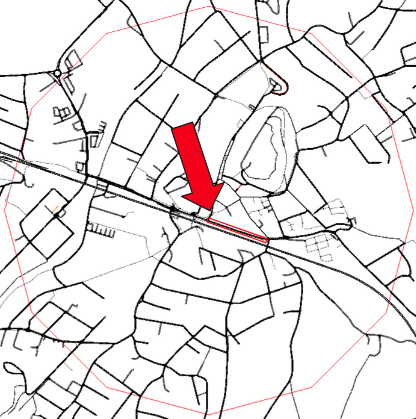
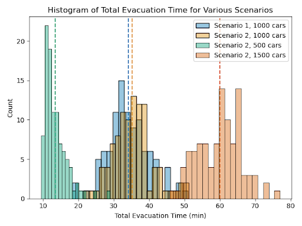

# 🚦 Traffic Evacuation Simulation using SUMO

## 🧠 TL;DR
Agent-based traffic simulation of emergency evacuation scenarios using **SUMO** and Python. This project analyzes evacuation performance, congestion patterns, and routing strategies to inform traffic planning.

## 🚀 Project Overview
Traffic evacuation modeling is essential for emergency planning (e.g., natural disasters, industrial accidents, urban evacuation drills). This repository provides a reproducible workflow that uses SUMO (Simulation of Urban MObility) to simulate evacuation scenarios and collect meaningful metrics on how traffic behaves under high-demand stress.

## 🎯 Motivation
Efficient evacuation performance can save lives in real emergencies.  
Key questions this project explores:

- How does congestion evolve as evacuation trips increase?
- What effects do different routing strategies have on total clearance time?
- Which network bottlenecks contribute most to overall delay?

By simulating evacuation demand over a realistic road network, we can explore these questions quantitatively.

## 🛠️ Tech Stack

| Component               | Purpose                         |
|-------------------------|---------------------------------|
| **SUMO**                | Traffic simulation engine       |
| **TraCI (Python API)**  | Real-time interaction with SUMO |
| **Python**              | Data processing & automation    |
| `matplotlib` / `pandas` | Analysis & visualization        |

## 👨‍💻 My Contributions
The repository was originally developed as a group project for the Modeling and Simulation course at the [Vienna University of Technology](https://www.tuwien.at/). 
- Refactored the original codebase to eliminate significant code duplication and ensure reproducibility through the use of random seeds and configuration files.
- Modularized simulation scripts for flexible scenario configuration
- Automated simulation execution and metric collection
- Analysis of simulation results.

## 🖥️ Sample Results
Neulengbach, Austria was chosen as the setting for the simulations. A danger zone that's 800 m in radius was defined at the center of the town. In some scenarios, a road was blocked, which is marked in the image below. 

 

A histogram of the total evacuation time for various configurations is shown below. Total evacuation time is measured as 
the time at which the last car leaves the danger zone. Scenario 1 refers to all roads being 
open, while scenario 2 is the road as marked above being blocked. In the latter case, the cars are informed beforehand and plan a route avoiding the blockage during initialization. Each configuration was
run 100 times. 

As expected, total evacuation time increases with the number of cars. What's a bit more unexpected is that blocking a major
road at the center of the danger zone only had a minimal effect on the total evacuation time (blue vs yellow).

 

## ⚙️ Installation & Setup
- Python 3.12
- [SUMO](https://sumo.dlr.de/docs/Downloads.php) installed and [added to system path](https://sumo.dlr.de/docs/Basics/Basic_Computer_Skills.html).
  - Important: `sumo` or `sumo-gui` must point to the correct binaries.
- Install required packages.
   ```
   pip install -r requirements.txt
   ```
- Adjust `config.yaml` as needed and run `driver.py`.
  - Note that it may take a minute for SUMO to activate after running `driver.py` for the first time.